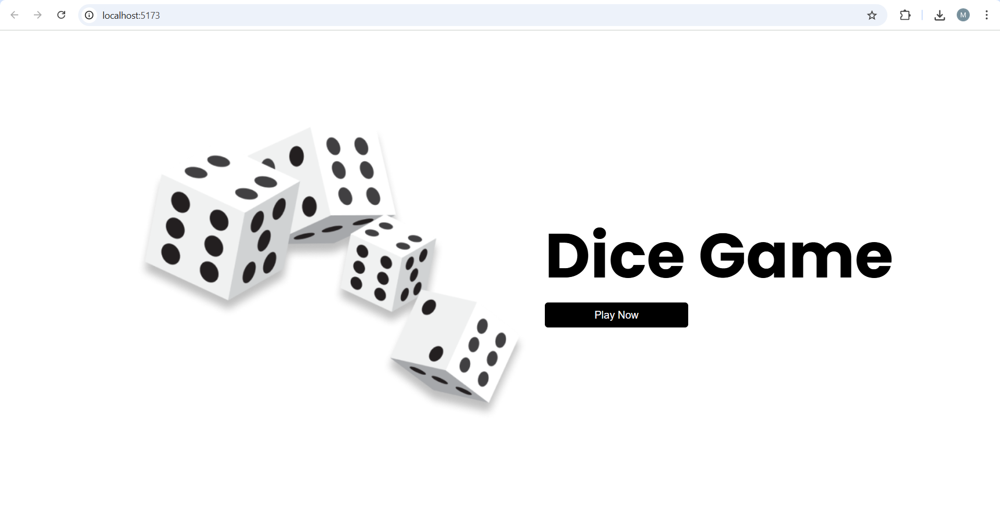
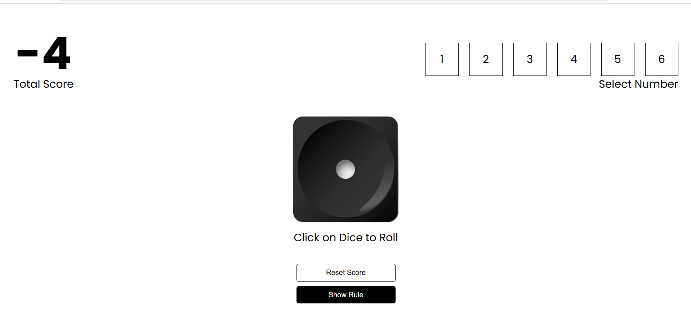

# Dice-Game


## 📝 Description

Roll the dice and test your luck with Dice-Game, a simple yet engaging web application built with React! This project provides a clean and intuitive interface for simulating dice rolls. While seemingly basic, it demonstrates fundamental React concepts, including component state management and event handling. Perfect for learning React or just having some quick fun!

## 🛠️ Tech Stack

- ⚛️ React

## Project Screenshot

Here are some screenshots of the project:




## 📦 Key Dependencies

```
react: ^19.1.0
react-dom: ^19.1.0
styled-components: ^6.1.19
```

## 🚀 Run Commands

- **dev**: `npm run dev`
- **build**: `npm run build`
- **lint**: `npm run lint`
- **preview**: `npm run preview`


## 📁 Project Structure

```
.
├── eslint.config.js
├── index.html
├── package.json
├── public
│   ├── dice_1.png
│   ├── dice_2.png
│   ├── dice_3.png
│   ├── dice_4.png
│   ├── dice_5.png
│   ├── dice_6.png
│   ├── dices.png
│   ├── dices.svg
│   └── vite.svg
├── src
│   ├── App.css
│   ├── App.jsx
│   ├── Components
│   │   ├── Gameplay.jsx
│   │   ├── Landingpg.jsx
│   │   ├── Numberselector.jsx
│   │   ├── Rolldice.jsx
│   │   ├── Rules.jsx
│   │   ├── Totalscore.jsx
│   │   └── styled
│   │       └── Button.js
│   ├── assets
│   │   └── react.svg
│   ├── index.css
│   └── main.jsx
└── vite.config.js
```

## 🛠️ Development Setup

### Node.js/JavaScript Setup
1. Install Node.js (v18+ recommended)
2. Install dependencies: `npm install` or `yarn install`
3. Start development server: (Check scripts in `package.json`, e.g., `npm run dev`)


## 👥 Contributing

Contributions are welcome! Here's how you can help:

1. **Fork** the repository
2. **Clone** your fork: `git clone https://github.com/m-ayaz-xyz/Dice-Game.git`
3. **Create** a new branch: `git checkout -b feature/your-feature`
4. **Commit** your changes: `git commit -am 'Add some feature'`
5. **Push** to your branch: `git push origin feature/your-feature`
6. **Open** a pull request

Please ensure your code follows the project's style guidelines and includes tests where applicable.
